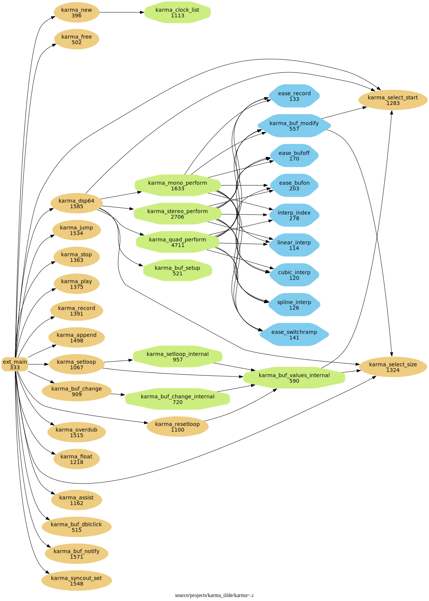
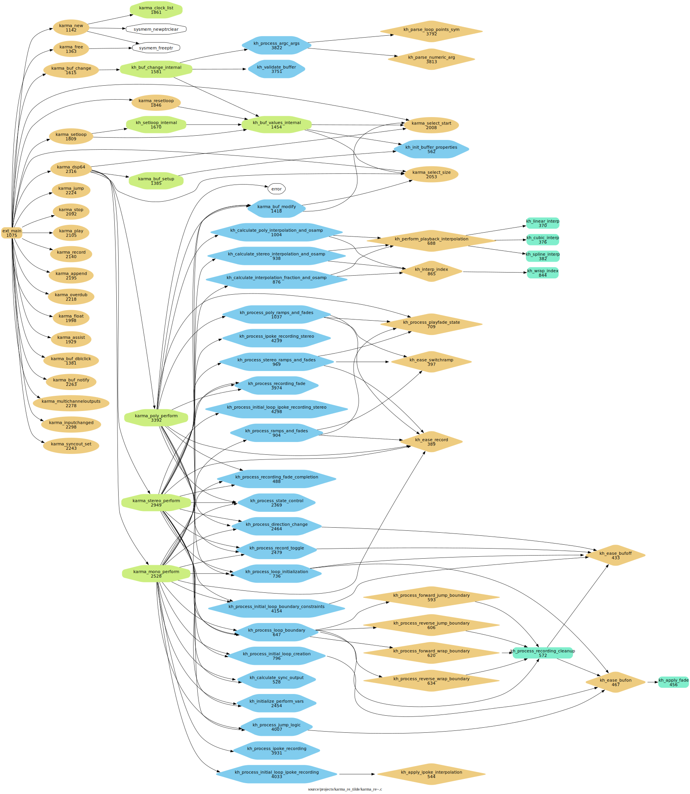

# karma_re~

As I have used Rodrigo Constanzo's & raja's & pete's amazing [karma~1.6](https://github.com/rconstanzo/karma) Max/MSP audio looper external in [another Max project](https://github.com/shakfu/groovin), I was curious enough about how it worked that I tried to read the c code of the external. 

I personally found the code to be very complex and difficult to understand, so I started to try to make it more understandable for me by doing the following:

- Drop the stereo and quad perform functions and just focus on refactoring the mono perform function

- Extract smaller functions from complex functions

- Add meaningful enums to make things more understandable

- Use `clang-format`, `clang-tidy`, and other AI tools to help in the refactoring process

- Use complexity tools like `gnu-complexity` to target the most complex parts of the code

- Use code analysis tools like `cflow` to figure out the overall call graph.


## Status

So far the project has produced three variants (which may not have the full featureset of `karma~` 1.6):

1. A refactored mono version which seemingly works ok, 
2. An experimental stereo version based on (1)
3. An experimental `mc.` variant based on (1)

Here are some graphs to illustrate the changes:


### karma~

```sh
% cloc source/projects/karma_tilde/karma\~.c
       1 text file.
       1 unique file.
       0 files ignored.

github.com/AlDanial/cloc v 2.06  T=0.02 s (44.4 files/s, 400047.2 lines/s)
-------------------------------------------------------------------------------
Language                     files          blank        comment           code
-------------------------------------------------------------------------------
C                                1            515            595           7903
-------------------------------------------------------------------------------
```
[pdf call-graph](./docs/cflow/karma_cflow_filter0.pdf)




### karma_re~

```sh
% cloc source/projects/karma_re_tilde/karma_re\~.c
       1 text file.
       1 unique file.
       0 files ignored.

github.com/AlDanial/cloc v 2.06  T=0.01 s (74.7 files/s, 335649.0 lines/s)
-------------------------------------------------------------------------------
Language                     files          blank        comment           code
-------------------------------------------------------------------------------
C                                1            455            460           3576
-------------------------------------------------------------------------------
```

[pdf call-graph](./docs/cflow/karma_re_cflow_filter0.pdf)




