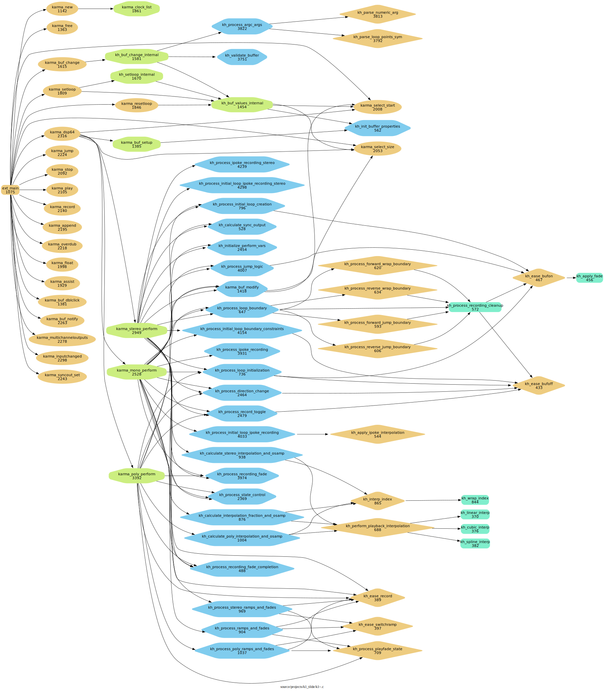
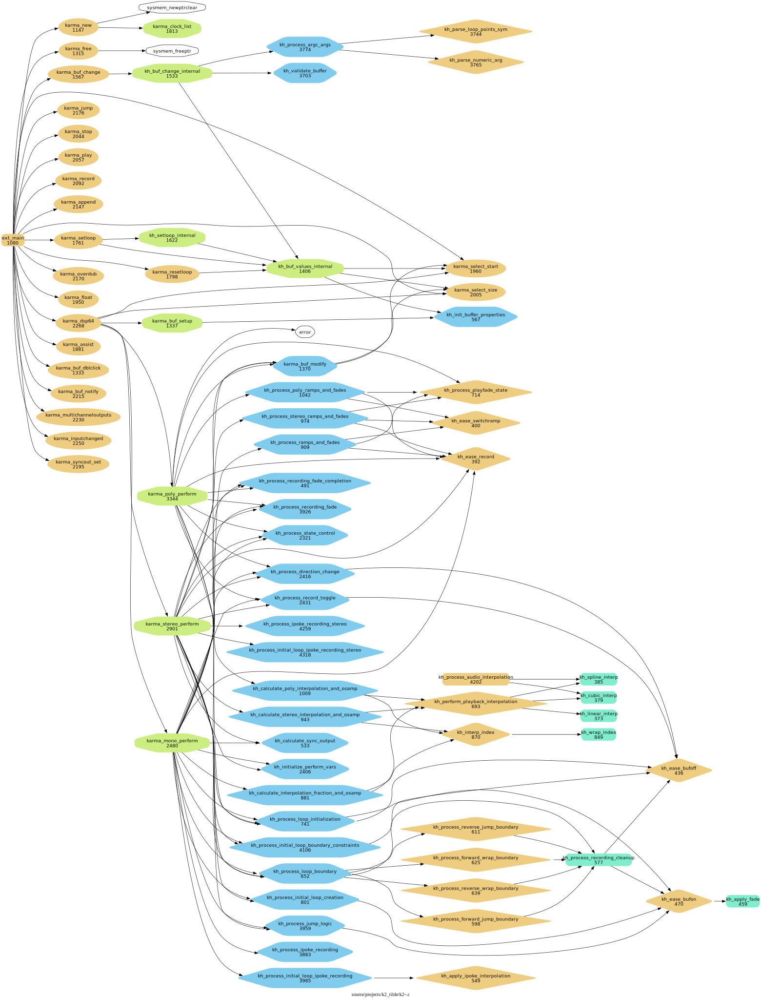
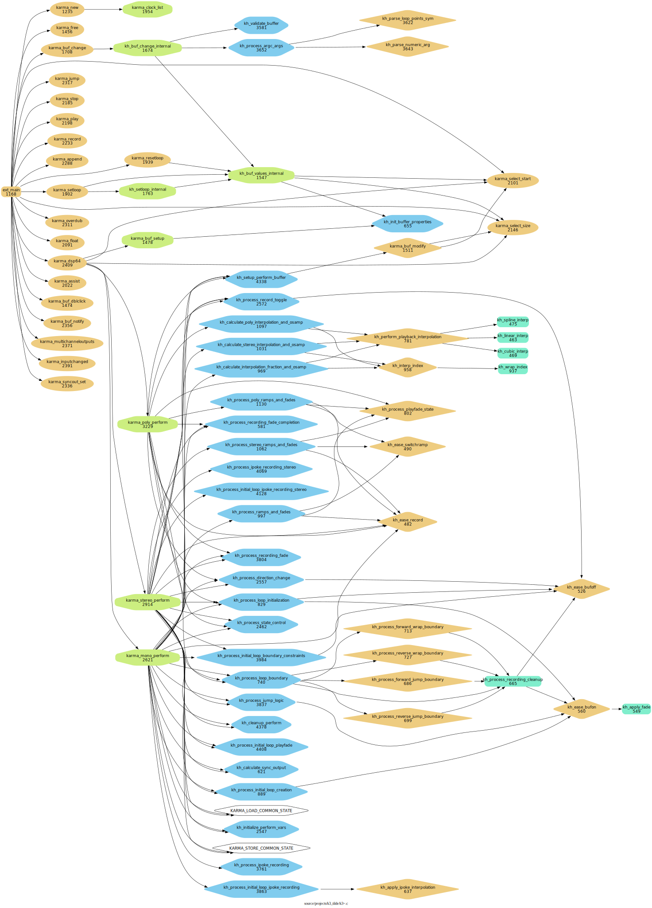

# karma_re~

As I have used Rodrigo Constanzo's & raja's & pete's amazing [karma~1.6](https://github.com/rconstanzo/karma) Max/MSP audio looper external in [another Max project](https://github.com/shakfu/groovin), I was curious enough about how it worked that I tried to read the c code of the external. 

I personally found the code to be very complex and difficult to understand, so I started to try to make it more understandable for me by doing the following:

- Initially drop the stereo and quad perform functions and just focus on refactoring the mono perform function

- Extract smaller functions from complex functions

- Add meaningful enums to make things more understandable

- Use `clang-format`, `clang-tidy`, and AI tools such as `claude-code` to help in the refactoring process

- Use complexity tools like `gnu-complexity` to target the most complex parts of the code

- Use code analysis tools like `cflow` to figure out the overall call graph.


## Status

So far the project has produced three refactored variants:


```text
-------------------------------------------------------------------------------
Variant                       Lang          blank        comment           code
-------------------------------------------------------------------------------
k3                               C            471            501           3490
-------------------------------------------------------------------------------
k2                               C            455            462           3596
-------------------------------------------------------------------------------
k1                               C            458            444           3591
-------------------------------------------------------------------------------
karma                            C            515            595           7903
-------------------------------------------------------------------------------
```


Here are some graphs to illustrate the changes:


### karma~

The original karma~ `1.6` version 

[pdf call-graph](./docs/cflow/karma-filter0.pdf)


### k1~

[pdf call-graph](./docs/cflow/k1-filter0.pdf)



### k2~

[pdf call-graph](./docs/cflow/k2-filter0.pdf)



### k3~

[pdf call-graph](./docs/cflow/k3-filter0.pdf)



