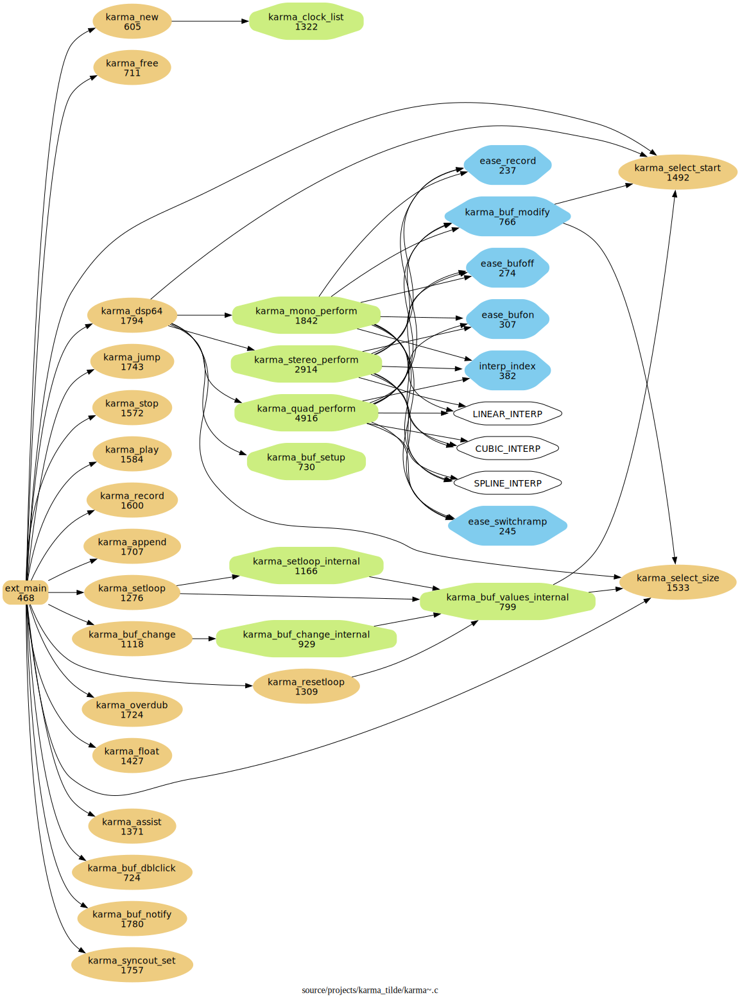
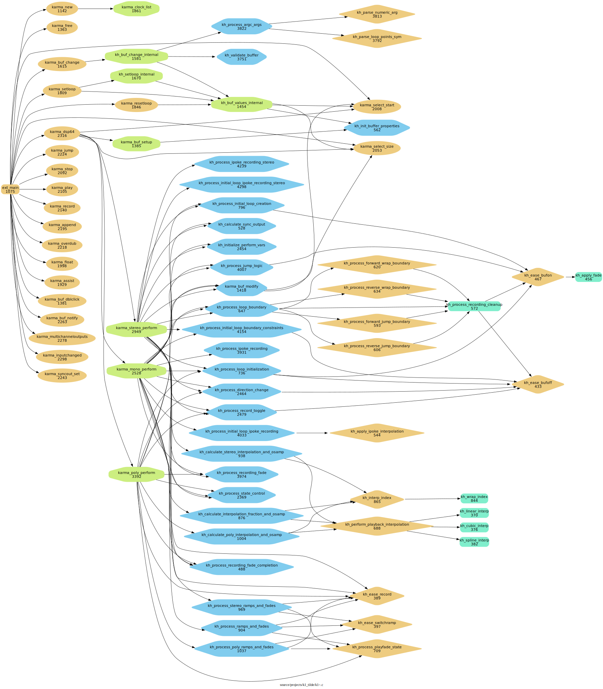
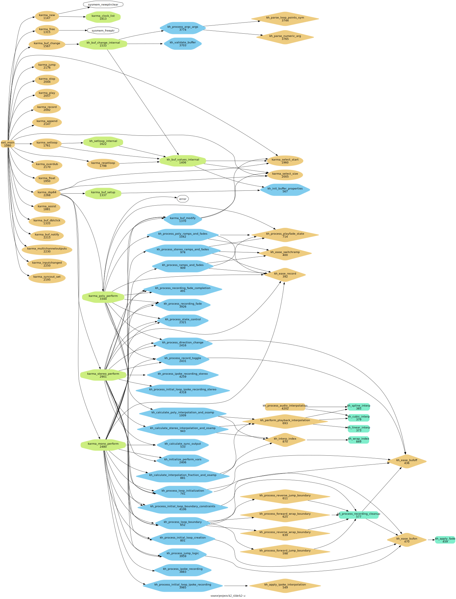
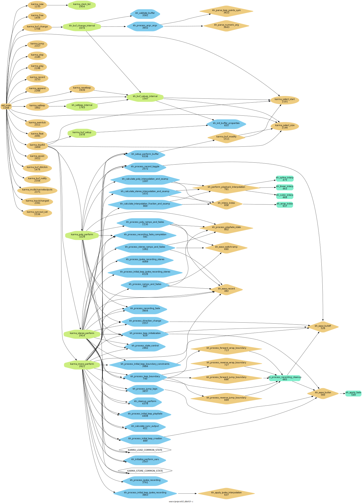

# karma_re~

As I have used Rodrigo Constanzo's & raja's & pete's amazing [karma~1.6](https://github.com/rconstanzo/karma) Max/MSP audio looper external in [another Max project](https://github.com/shakfu/groovin), I was curious enough about how it worked that I tried to read the c code of the external. 

I personally found the code to be very complex and difficult to understand, so I started to try to make it more understandable for me by doing the following:

- Initially drop the stereo and quad perform functions and just focus on refactoring the mono perform function

- Extract smaller functions from complex functions

- Add meaningful enums to make things more understandable

- Use `clang-format`, `clang-tidy`, and AI tools such as `claude-code` to help in the refactoring process

- Use complexity tools like `gnu-complexity` to target the most complex parts of the code

- Use code analysis tools like `cflow` to figure out the overall call graph.


## karma_core + karma_re~ (current)

The project has since converged on a cleaner architecture than the early
`k1`/`k2`/`k3` whole-external rewrites: split the looper into a portable DSP
**core** and a thin Max **shell**.

- **`karma_core`** (`source/projects/karma_core/`) is the looper DSP extracted
  out of Max. It pulls in no Max/MSP headers (only `<math.h>` / `<string.h>` /
  `<stdint.h>`); the host supplies the sample buffer through a small callback
  interface (`karma_buffer_iface`). It can be built standalone (CLI tools, other
  plugin formats) or dropped into a Max host unchanged.
- **`karma_re~`** (`source/projects/karma_re_tilde/`) is the Max external: a thin
  shell (~390 lines) that owns only the Max plumbing (object / inlets / outlets /
  `buffer~` / clock / attributes) and forwards buffer access, control messages,
  and per-vector perform to the embedded core.

The refactor was done against a **sample-exact differential harness**
(`tests/`): every change is held to reproduce the reference `karma~` bit-for-bit
across 21 scripted scenarios (record / play / overdub / reverse / speed / jump /
stop / window across mono / stereo / quad, plus buffer-channel < output-channel
cases), output **and** final buffer **and** the report outlet, plus kernel unit
tests. `cd tests && make check` is the gate; see `tests/README.md`.

Highlights of the core refactor (see `CHANGELOG.md`):

- The reference's three near-identical mono/stereo/quad perform routines
  (~7k lines) are unified into **one channel-generic routine**.
- The undocumented `statecontrol` / fade-flag state machine is replaced with
  named enums (`karma_state.h`).
- Interpolation and the record/ipoke write engine are split into reusable kernel
  headers (`karma_interp.h`, `karma_ipoke.h`).
- `karma_core.c` is now **~1.4k lines** (from ~7.7k as first extracted), with
  the DSP behaviour proven identical to the reference.


## Build & test

The repo holds two independent build flows: the **Max external** (needs the c74
SDK) and the **offline test harness** (does not need Max running).

Prerequisites: the c74 SDK submodule at `source/max-sdk-base`
(`git submodule update --init --recursive`), CMake, and a C toolchain (Xcode on
macOS).

**Build the Max external(s).** The top-level CMake auto-discovers every
`source/projects/<name>/CMakeLists.txt`, so this builds `karma_re~` (and the
other variants) into `externals/`:

```
make build      # Xcode generator, Release  -> externals/*.mxo
make dev        # default generator, Debug
make link       # symlink this package into ~/Documents/Max 8|9/Packages
make clean      # rm -rf build externals
```

`karma_re~` compiles `karma_core.c` directly (see
`source/projects/karma_re_tilde/CMakeLists.txt`), so the portable core is built
into the external; there is no separate core library to install.

**Run the offline harness** (drives the DSP outside Max against a mock `buffer~`
and diffs it against the reference sample-for-sample):

```
cd tests
make check      # full gate: ref==core, ref==shell, kernel unit tests
make diff       # ref-vs-core sample-exact differential
make shelldiff  # ref-vs-(karma_re~ shell) differential
make unit       # kernel unit tests
make bench      # perform-only throughput: unified core vs reference (unrolled)
```

See `tests/README.md` for the harness internals and
`source/projects/karma_core/README.md` for the core library API.


## Status

The early whole-external rewrites (`k1`/`k2`/`k3`) and the original are shown
below for context (the current work lives in `karma_core` + `karma_re~` above):


```text
-------------------------------------------------------------------------------
Variant                       Lang          blank        comment           code
-------------------------------------------------------------------------------
k3                               C            471            501           3490
-------------------------------------------------------------------------------
k2                               C            455            462           3596
-------------------------------------------------------------------------------
k1                               C            458            444           3591
-------------------------------------------------------------------------------
karma-1.6                        C            515            595           7903
-------------------------------------------------------------------------------
```


Here are some graphs to illustrate the changes:


### karma~

The original karma~ `1.6` version 

[pdf call-graph](./docs/cflow/karma-filter0.pdf)




### k1~

[pdf call-graph](./docs/cflow/k1-filter0.pdf)



### k2~

[pdf call-graph](./docs/cflow/k2-filter0.pdf)



### k3~

[pdf call-graph](./docs/cflow/k3-filter0.pdf)



