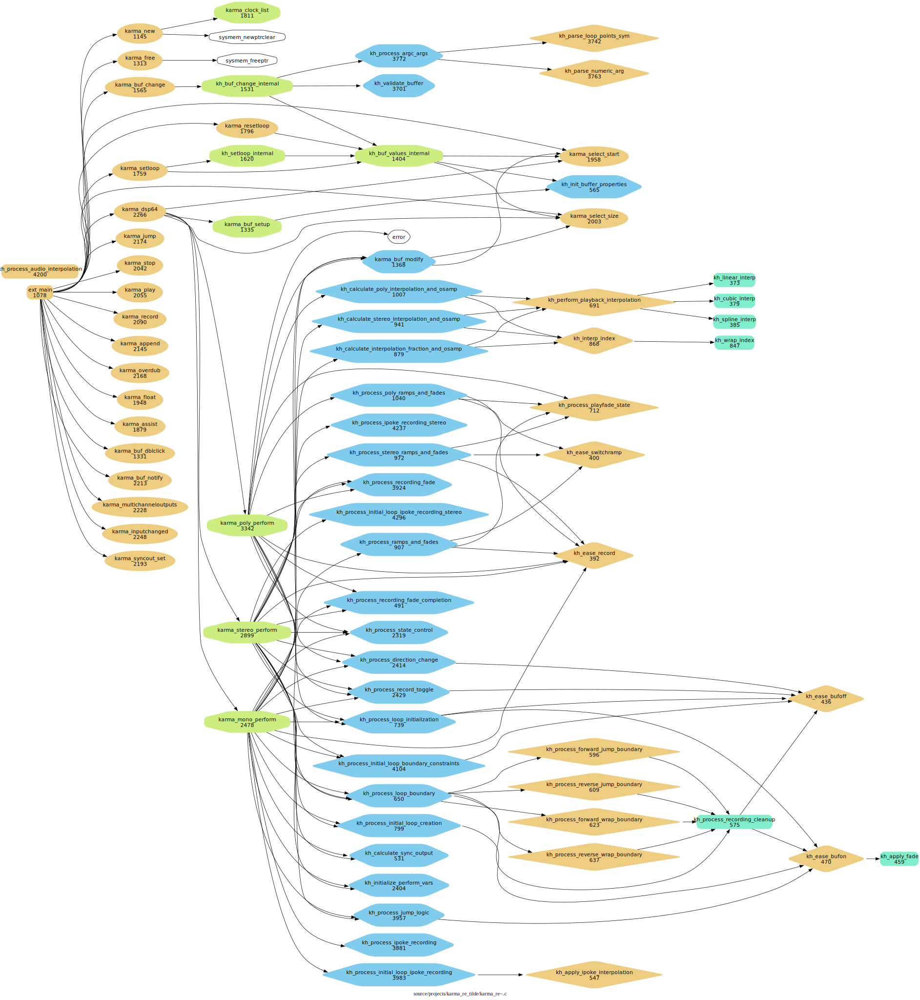

# karma_re~ -- Refactoring Mono Karma~

As I have used Rodrigo Constanzo's & raja's & pete's [karma~1.6](https://github.com/rconstanzo/karma) Max/MSP audio looper plugin in [another Max project](https://github.com/shakfu/groovin), I was curious enough about how it worked that I tried to read the c code of the external. 

I found it to be very complex and difficult to understand, so I started trying to do things to make it more understandable for me:

- Extract smaller functions from complex functions

- Add enums to make things more understandable

- Use clang-format, clang-tidy, and other AI tools to help in the process

- Drop stereo and quad perform functions and just focus on refactoring the mono perform function

- Use code analysis tools like cflow to figure out the call graph

## Status

- This is still a work in progress but there are some graphs to illustrate addition of helper functions.

### karma~

[pdf call-graph](./docs/cflow/karma_cflow_filter0.pdf)

### karma_re~

[pdf call-graph](./docs/cflow/karma_re_cflow_filter0.pdf)

