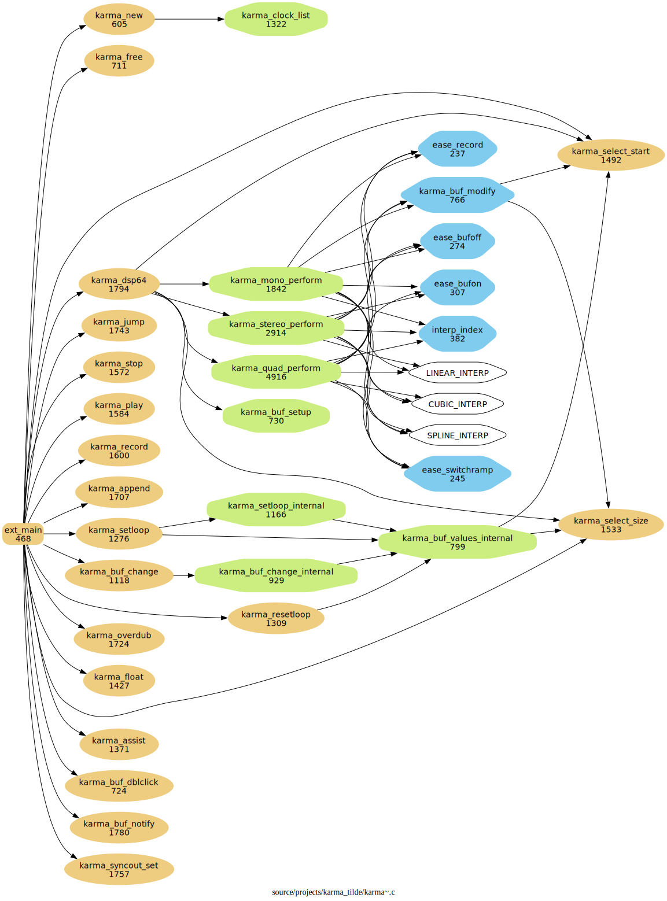

# karma_re~

As I have used Rodrigo Constanzo's & raja's & pete's amazing [karma~1.6](https://github.com/rconstanzo/karma) Max/MSP audio looper external in [another Max project](https://github.com/shakfu/groovin), I was curious enough about how it worked that I tried to read the c code of the external. 

I personally found the code to be very complex and difficult to understand, so I started to try to make it more understandable for me by doing the following:

- Drop the stereo and quad perform functions and just focus on refactoring the mono perform function

- Extract smaller functions from complex functions

- Add meaningful enums to make things more understandable

- Use `clang-format`, `clang-tidy`, and other AI tools to help in the refactoring process

- Use complexity tools like `gnu-complexity` to target the most complex parts of the code

- Use code analysis tools like `cflow` to figure out the overall call graph.

## Status

- This is still a work in progress but the refactored mono version seemingly works ok, and an experimental stereo version is also included based on the refactored code.

Here are some graphs to illustrate the changes:

### karma~

[pdf call-graph](./docs/cflow/karma_cflow_filter0.pdf)

### karma_re~

[pdf call-graph](./docs/cflow/karma_re_cflow_filter0.pdf)

